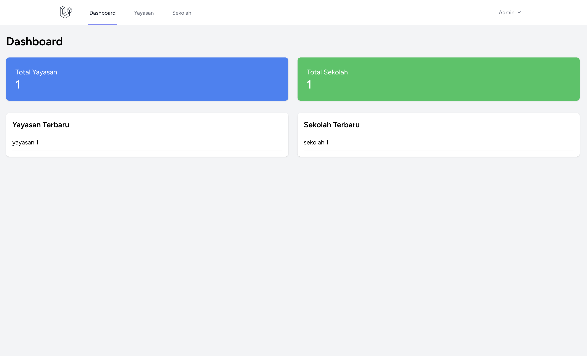
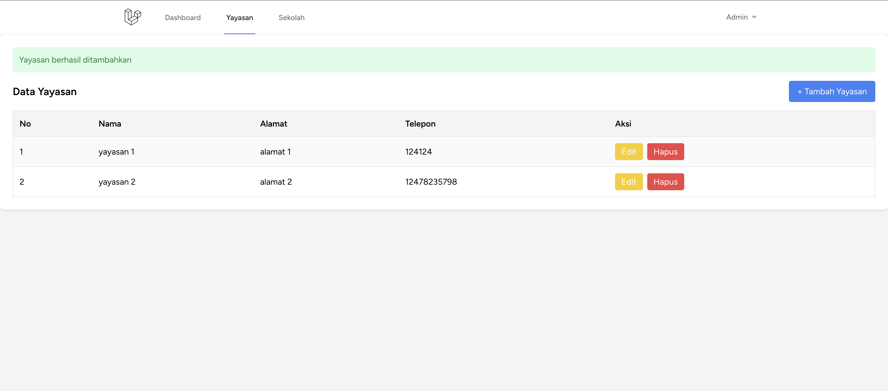
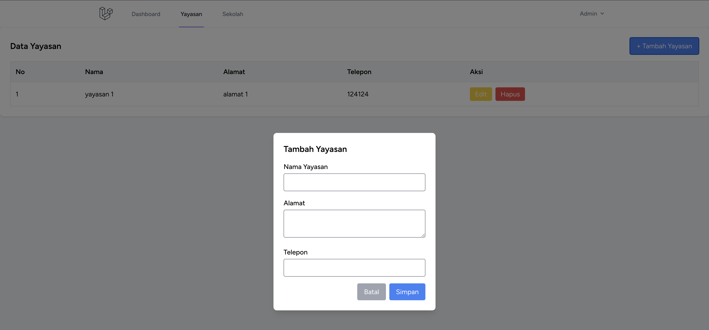
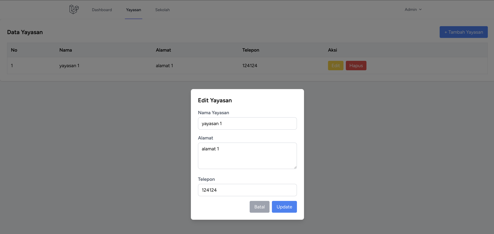
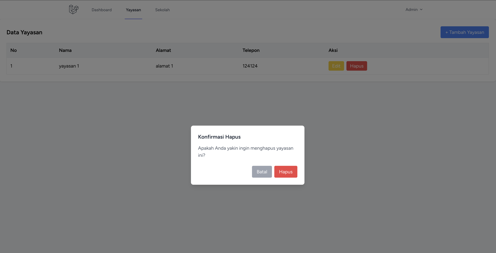
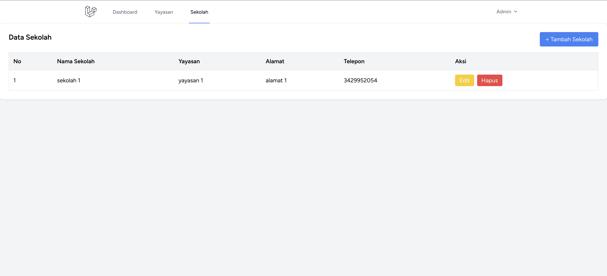
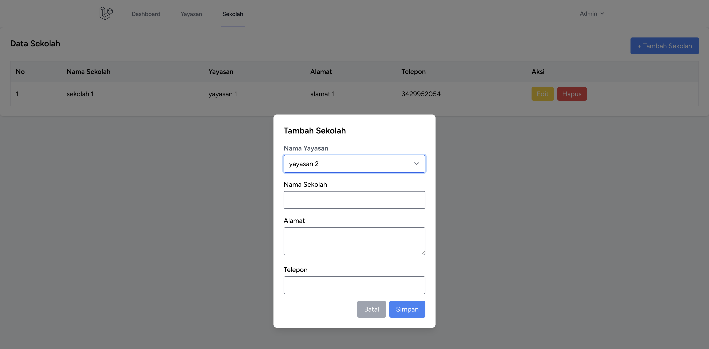
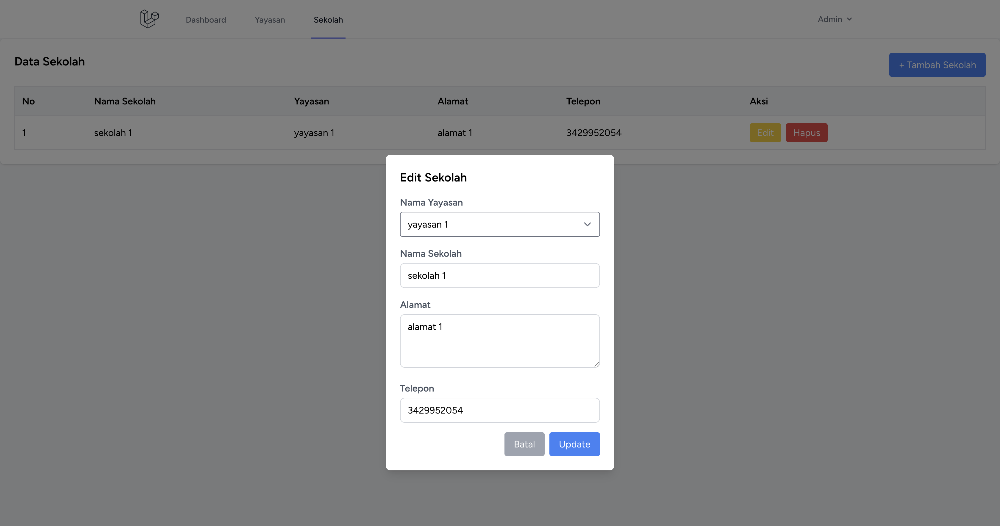
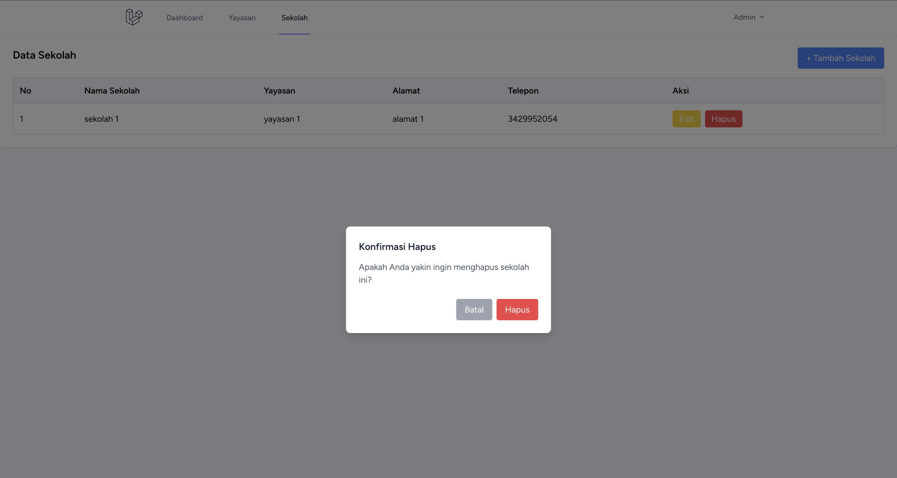

# Sistem Manajemen Yayasan dan Sekolah

Aplikasi sederhana berbasis **Laravel** untuk mengelola data **Yayasan** dan **Sekolah**.
Project ini dibuat sebagai bagian dari **technical test STAF IT**.

Aplikasi menyediakan fitur CRUD untuk Yayasan dan Sekolah dengan relasi:

**1 Yayasan dapat memiliki banyak Sekolah**

---

# Tech Stack

* Laravel
* Blade Template
* Tailwind CSS
* Alpine.js
* MySQL / MariaDB

---

# Fitur Aplikasi

### Manajemen Yayasan

* Menampilkan daftar yayasan
* Menambahkan yayasan (modal popup)
* Mengedit yayasan (modal popup)
* Menghapus yayasan dengan konfirmasi modal
* Validasi agar yayasan tidak dapat dihapus jika masih memiliki sekolah

### Manajemen Sekolah

* Menampilkan daftar sekolah
* Menambahkan sekolah (modal popup)
* Mengedit sekolah (modal popup)
* Menghapus sekolah dengan konfirmasi modal
* Relasi ke yayasan

### Dashboard

Menampilkan informasi sederhana seperti:

* jumlah yayasan
* jumlah sekolah

---

# Struktur Database (ERD)

## Table: yayasans

| Field        | Type      |
| ------------ | --------- |
| id           | bigint    |
| nama_yayasan | string    |
| alamat       | text      |
| telepon      | string    |
| created_at   | timestamp |
| updated_at   | timestamp |

---

## Table: sekolahs

| Field        | Type        |
| ------------ | ----------- |
| id           | bigint      |
| yayasan_id   | foreign key |
| nama_sekolah | string      |
| alamat       | text        |
| created_at   | timestamp   |
| updated_at   | timestamp   |

# Instalasi Project

### 1 Clone repository

```
git clone https://github.com/username/project-yayasan.git
cd project-yayasan
```

### 2 Install dependency

```
composer install
```

### 3 Copy file environment

```
cp .env.example .env
```

### 4 Generate key

```
php artisan key:generate
```

### 5 Setup database di file `.env`

```
DB_DATABASE=nama_database
DB_USERNAME=root
DB_PASSWORD=
```

---

# Migrasi Database

```
php artisan migrate
```

---

# Seeder

```
php artisan db:seed
```

---

# Menjalankan Aplikasi

```
php artisan serve
```

Buka di browser:

```
http://localhost:8000
```

---

Default Login
----------------------
email : admin@test.com
password : password

# Struktur Folder Penting

```
app/
 ├── Models
 │    ├── Yayasan.php
 │    └── Sekolah.php
 │
 ├── Http/Controllers
 │    ├── YayasanController.php
 │    └── SekolahController.php

resources/views
 ├── layouts
 │    └── app.blade.php
 │
 ├── yayasan
 │    └── index.blade.php
 │
 └── sekolah
      └── index.blade.php
```

---

# Validasi Penghapusan Yayasan

Yayasan tidak dapat dihapus jika masih memiliki sekolah.

Contoh implementasi di controller:

```
public function destroy(Yayasan $yayasan)
{
    if ($yayasan->sekolah()->exists()) {
        return redirect()->route('yayasan.index')
            ->with('error', 'Yayasan tidak bisa dihapus karena masih memiliki sekolah.');
    }

    $yayasan->delete();

    return redirect()->route('yayasan.index')
        ->with('success', 'Yayasan berhasil dihapus');
}
```

---

# UI Implementation

UI dibangun menggunakan:

* **Tailwind CSS** untuk styling
* **Alpine.js** untuk interaksi seperti modal popup

Fitur UI:

* Modal Create
* Modal Edit
* Modal Delete Confirmation
* Responsive Table
* Alert success / error

---

# Tampilan Aplikasi

# Dashboard


# Data Yayasan


# Modal Tambah Yayasan


# Modal Edit Yayasan


# Modal Delete Yayasan


# Data Sekolah


### Modal Tambah Sekolah


# Modal Edit Sekolah


# Modal Delete Sekolah


# Author

Tomi Mulki

---

# Lisensi

Project ini dibuat untuk tujuan pembelajaran dan technical test.
